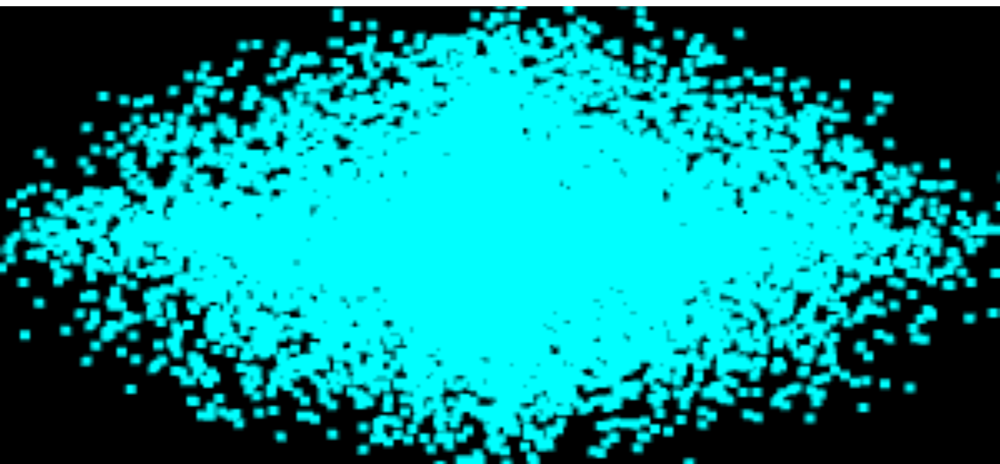

# Lab 1 - WebGL Point Cloud

## 📌 Aim
To create and render a static 3D point cloud using WebGL.

## ⚙️ Technologies Used
- HTML
- JavaScript
- WebGL

## ▶️ How to Run
1. Open `pointcloud.html` in browser
2. Or use Live Server in VS Code

## 📸 Output

## ✅ Result
A static 3D point cloud was successfully rendered.